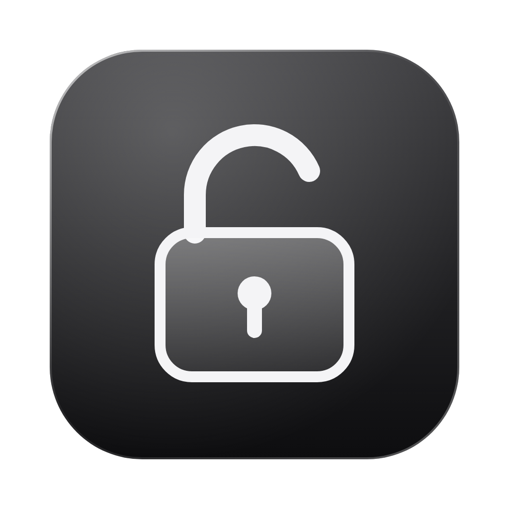
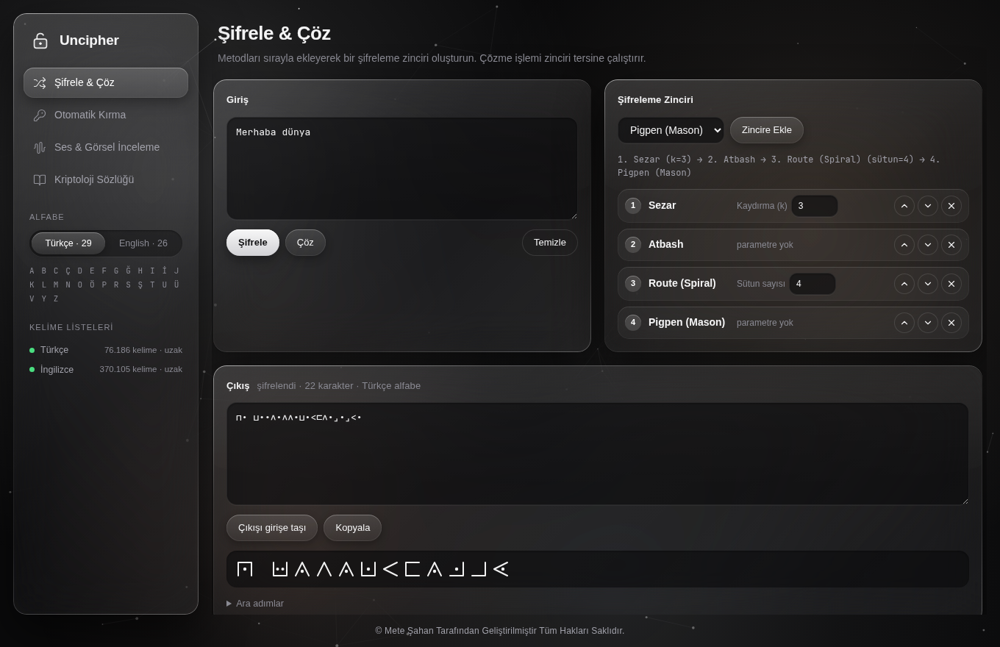
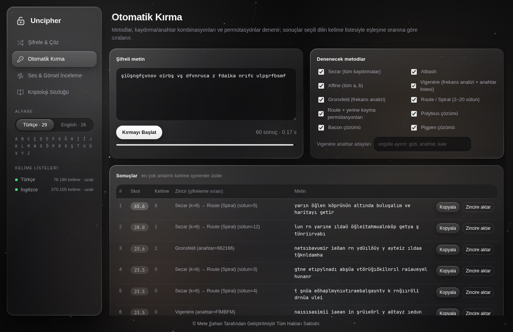
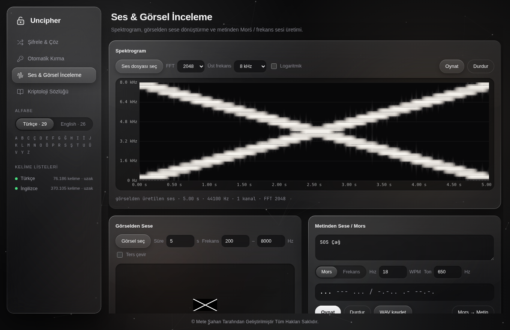
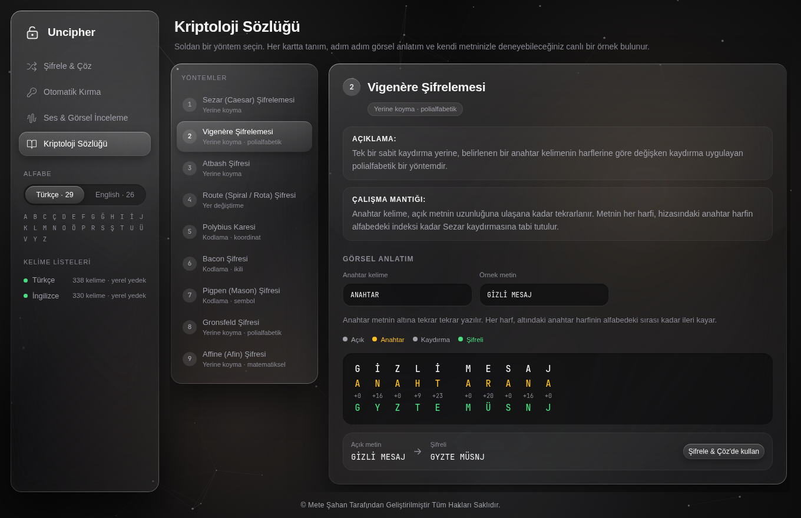
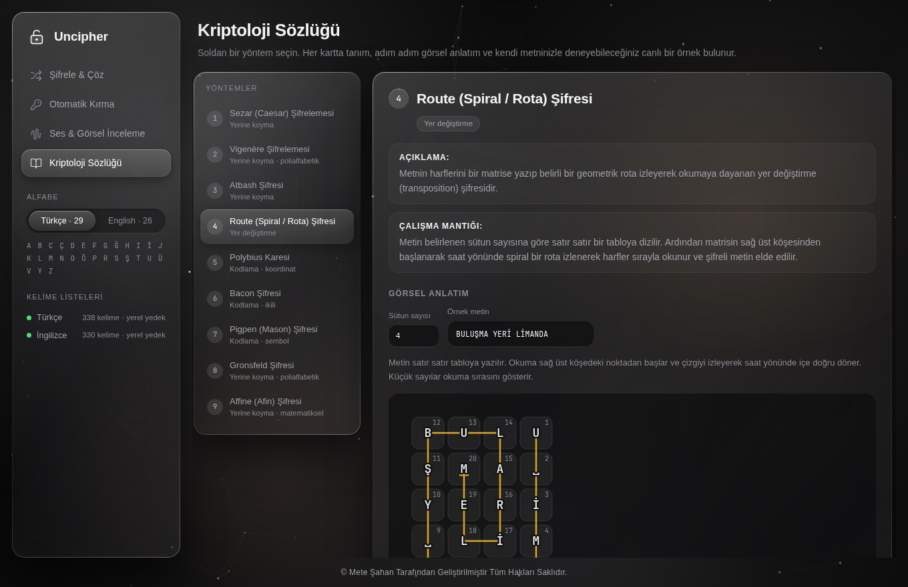
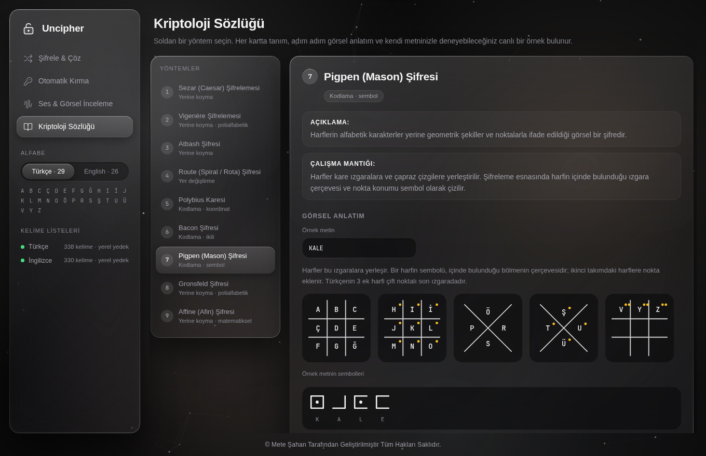

<p align="center">
  
</p>

<h1 align="center">Uncipher</h1>

<p align="center">
  Klasik şifreleme yöntemleri için masaüstü uygulaması: zincirleme şifreleme ve çözme,
  kelime listesiyle otomatik kırma, ses ve görsel inceleme, görsel anlatımlı kriptoloji sözlüğü.
  <br>macOS ve Windows'ta kendi penceresinde çalışır. Türkçe (29 harf) ve İngilizce (26 harf) alfabeyi destekler.
</p>

<p align="center">
  <a href="https://github.com/metesahan/Uncipher/releases/latest"><b>⬇ Son sürümü indir</b></a>
</p>



---

## İçindekiler

- [İndirme ve kurulum](#i̇ndirme-ve-kurulum)
- [Özellikler](#özellikler)
- [Desteklenen yöntemler](#desteklenen-yöntemler)
- [Kullanım](#kullanım)
- [Kaynak koddan çalıştırma](#kaynak-koddan-çalıştırma)
- [Proje yapısı](#proje-yapısı)
- [Yeni sürüm yayınlama](#yeni-sürüm-yayınlama)

---

## İndirme ve kurulum

### 1. Hazır uygulama (en kolayı)

[Releases](https://github.com/metesahan/Uncipher/releases/latest) sayfasından işletim sistemine uygun dosyayı indir:

| Sistem | Dosya | Ne yapmalı |
|---|---|---|
| macOS (Apple Silicon: M1/M2/M3/M4) | `Uncipher-macOS.zip` | Zip'i aç, `Uncipher.app`'i **Uygulamalar** klasörüne sürükle, çift tıkla. |
| Windows 10/11 | `Uncipher-Windows.exe` | Çift tıkla. Kurulum gerekmez. |

**İlk açılışta uyarı çıkarsa:** Uygulama Apple ve Microsoft tarafından imzalanmadığı için internetten indirildiğinde bir kez uyarı gösterilir.

- **macOS:** "Uncipher açılamıyor" uyarısında **Bitti**'ye bas. Sonra **Sistem Ayarları → Gizlilik ve Güvenlik** sayfasının en altındaki **Yine de Aç** düğmesine bas. Bu işlem bir kez yapılır.
- **Windows:** "Windows bilgisayarınızı korudu" ekranında **Ek bilgi → Yine de çalıştır**'a tıkla.

> Intel işlemcili bir Mac kullanıyorsan aşağıdaki **tek tık kurulum** yöntemini kullan. Bu yöntem uygulamayı senin bilgisayarında derler ve uyarı çıkarmaz.

### 2. Tek tık kurulum (uygulamayı kendi bilgisayarında derler)

1. Bu sayfada **Code → Download ZIP** ile projeyi indir ve aç.
2. İşletim sistemine göre:
   - **macOS:** `Uncipher Kurulum.command` dosyasına çift tıkla.
   - **Windows:** `Uncipher Kurulum.bat` dosyasına çift tıkla.
3. Kurulum gerekli paketleri kurar ve uygulamayı oluşturur. macOS'ta `Uncipher.app` **Uygulamalar** klasörüne, Windows'ta `Uncipher.exe` **Masaüstü**'ne konur ve açılır.
4. Bundan sonra uygulamayı her seferinde tek tıkla açarsın.

Ayrıntılar ve sorun çıkarsa yapılacaklar için: [docs/KURULUM.md](docs/KURULUM.md)

**Gereksinim:** Python 3.9 veya üstü. macOS'un kendi Python'u (Xcode Command Line Tools ile gelen 3.9) yeterlidir. Python hiç yoksa kurulum dosyası indirme sayfasını açar.

---

## Özellikler

### Şifrele & Çöz — zincirleme şifreleme

Yöntemleri sırayla ekleyerek bir şifreleme zinciri kur (örn. **1. Sezar → 2. Atbash → 3. Route**). **Çöz** düğmesi zinciri tersine çalıştırır. Her adımın ara çıktısı görülebilir. Pigpen çıktısı ayrıca sembol olarak çizilir.


### Otomatik Kırma — kelime listesi ve permütasyon

Bilinmeyen şifreli metni yapıştır. Uygulama şunları dener:

- Tüm Sezar kaydırmaları, Atbash, tüm Affine (a, b) çiftleri
- Vigenère ve Gronsfeld için frekans analiziyle anahtar tahmini, ayrıca girdiğin anahtar adayları
- 2–20 sütunluk Route (spiral) çözümleri ve bunların yerine koyma yöntemleriyle permütasyonları
- Polybius, Bacon ve Pigpen kodlarının otomatik tespiti ve çözümü

Her sonuç seçilen dilin kelime listesiyle karşılaştırılır. En çok anlamlı kelime içeren sonuç en üstte gösterilir. **Zincire aktar** düğmesi bulunan zinciri Şifrele & Çöz ekranına taşır.



Kelime listeleri açılışta indirilir ve bilgisayarda önbelleğe alınır:

- Türkçe: [CanNuhlar/Turkce-Kelime-Listesi](https://github.com/CanNuhlar/Turkce-Kelime-Listesi)
- İngilizce: [dwyl/english-words](https://github.com/dwyl/english-words) (`words_alpha.txt`)

İnternet yoksa önce son indirilen liste, o da yoksa uygulamayla gelen küçük yedek liste kullanılır.

### Ses & Görsel İnceleme

- **Spektrogram:** wav, mp3, ogg, flac gibi bir ses dosyasının frekans-zaman grafiğini çizer. FFT boyutu, üst frekans ve logaritmik ölçek seçilebilir.
- **Görselden Sese:** Bir resmin piksellerini osilatörlerle sese dönüştürür. Her satır bir frekans, her sütun bir zaman dilimidir. Üretilen ses spektrogramda resmin kendisi olarak görünür ve WAV olarak kaydedilebilir.
- **Metinden Sese / Mors:** Metni Mors sinyaline (Türkçe harfler dahil) ya da harf başına farklı frekanslı tonlara çevirir. Çalarken çalınan harf vurgulanır. **Mors → Metin** ile Mors kodu geri çözülür.



### Kriptoloji Sözlüğü — görsel anlatım

Dokuz yöntemin her biri için tanım, çalışma mantığı, adım adım görsel şema ve kendi metninle deneyebileceğin canlı bir örnek bulunur. **Şifrele & Çöz'de kullan** düğmesi yöntemi doğrudan zincire ekler.

| Vigenère | Route (Spiral) | Pigpen |
|---|---|---|
|  |  |  |

---

## Desteklenen yöntemler

| # | Yöntem | Tür | Parametre |
|---|---|---|---|
| 1 | Sezar (Caesar) | Yerine koyma | Kaydırma `k` |
| 2 | Vigenère | Polialfabetik yerine koyma | Anahtar kelime |
| 3 | Atbash | Yerine koyma | — |
| 4 | Route (Spiral) | Yer değiştirme | Sütun sayısı |
| 5 | Polybius Karesi | Koordinat kodlama | — (TR 5×6, EN 5×5, I/J birleşik) |
| 6 | Bacon | İkili kodlama | — |
| 7 | Pigpen (Mason) | Sembol kodlama | — |
| 8 | Gronsfeld | Polialfabetik yerine koyma | Sayısal anahtar |
| 9 | Affine (Afin) | Matematiksel yerine koyma | `a`, `b` (a ile N aralarında asal) |

Türkçe alfabe: `A B C Ç D E F G Ğ H I İ J K L M N O Ö P R S Ş T U Ü V Y Z` (29 harf)

---

## Kullanım

1. Sol menüden **Alfabe** olarak Türkçe ya da English seç.
2. **Şifrele & Çöz:** Metni yaz, menüden yöntem seçip **Zincire Ekle**'ye bas, parametreleri ayarla, **Şifrele** ya da **Çöz**'e bas.
3. **Otomatik Kırma:** Şifreli metni yapıştır, denenecek yöntemleri işaretle, **Kırmayı Başlat**'a bas.
4. **Ses & Görsel İnceleme:** Ses ya da görsel dosyası seç, ya da Mors için metin yaz.
5. **Kriptoloji Sözlüğü:** Soldan bir yöntem seç, örnek metni değiştirerek şemanın nasıl değiştiğini izle.

---

## Kaynak koddan çalıştırma

```bash
git clone https://github.com/metesahan/Uncipher.git
cd Uncipher
python3 -m pip install -r requirements.txt
python3 main.py
```

Elle tek dosya uygulama derlemek için:

```bash
# macOS → dist/Uncipher.app
pyinstaller --noconfirm --windowed --name Uncipher --add-data "ui:ui" main.py

# Windows → dist\Uncipher.exe
pyinstaller --noconfirm --onefile --windowed --name Uncipher --add-data "ui;ui" main.py
```

Testler (Node.js gerekir):

```bash
node tests/test_crypto.js                                   # 9 yöntem × 2 alfabe gidiş-dönüş testleri
node tests/test_crypto.js turkce_liste.txt english_list.txt # + otomatik kırma testleri
```

---

## Proje yapısı

```
main.py                    Pencere (pywebview), kelime listesi servisi, dosya kaydetme
requirements.txt           Python bağımlılıkları (Python 3.9 için pyobjc 11.1 sabitlemesi dahil)
Uncipher Kurulum.command   macOS tek tık kurulum
Uncipher Kurulum.bat       Windows tek tık kurulum
ui/
  index.html               Arayüz iskeleti, sözlük metinleri, alt bilgi
  styles.css               Koyu Liquid Glass stilleri
  background.js            Fareye tepki veren Canvas ağı
  crypto.js                9 şifreleme yöntemi, zincir, Mors
  breaker.js               Otomatik kırma ve kelime eşleşme skorlaması
  worker.js                Kırma işlemini arka planda çalıştırır
  audio.js                 Spektrogram, görselden sese, Mors/frekans sesleri, WAV
  glossary.js              Sözlükteki görsel anlatımlar ve canlı örnekler
  data/                    Çevrimdışı yedek kelime listeleri
  fonts/                   JetBrains Mono (SIL Open Font License)
assets/                    Uygulama simgesi
docs/                      Kurulum rehberi, tasarım notları, ekran görüntüleri
tests/                     Kripto ve kırma testleri
.github/workflows/         macOS ve Windows sürümlerini otomatik derleyen iş akışı
VERSION                    Yayınlanacak sürüm numarası
```

---

## Yeni sürüm yayınlama

`main` dalına her gönderimde GitHub Actions uygulamayı macOS ve Windows'ta derler ve `VERSION` dosyasındaki numarayla **Releases** sayfasında yayınlar. Yeni bir sürüm için `VERSION` içindeki numarayı artırıp (örn. `1.0.1`) gönder. Numara değişmezse aynı sürümün dosyaları yenilenir.

İş akışı **Actions → Uygulamayı derle → Run workflow** ile elle de çalıştırılabilir; bu durumda derlenen dosyalar çalışmanın **Artifacts** bölümünde bulunur.

---

<p align="center">© Mete Şahan Tarafından Geliştirilmiştir Tüm Hakları Saklıdır.</p>
<p align="center"><sub>JetBrains Mono yazı tipi SIL Open Font License 1.1 ile dağıtılır (ui/fonts/OFL.txt).</sub></p>
